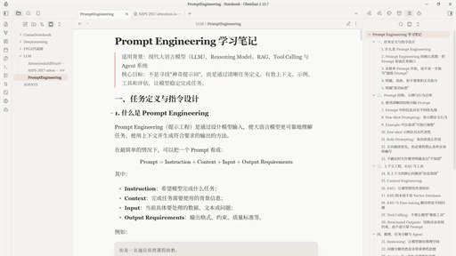
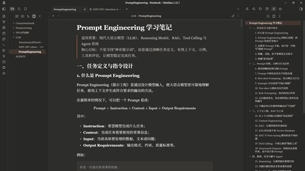

# AbsolutelyBaseline

[English](./README.md) | **中文**

一个安静、暖调的 Obsidian 主题，为长时间阅读和写作而做。衬线正文、柔和的中性底色，只有一处陶土色的强调色。

| 浅色 | 深色 |
| :---: | :---: |
|  |  |

*点击任一张可查看原尺寸。*

> 想要磨砂玻璃？[AbsolutelyGlass](https://github.com/dingye0604/AbsolutelyGlass) 建立在本主题之上，追加半透明面板，并可在 Windows 11 上启用原生 Acrylic。

## 安装

**在 Obsidian 里装**——设置 → 外观 → 主题 → 管理，搜索 **AbsolutelyBaseline**，点「安装并使用」。

**手动装**——从[最新 release](https://github.com/dingye0604/AbsolutelyBaseline/releases/latest) 下载 `manifest.json` 和 `theme.css`，放进 `<你的库>/.obsidian/themes/AbsolutelyBaseline/`，然后重启 Obsidian。

## 它改了什么

**暖色、低对比的表面。** 浅色模式是米白 `#f9f9f7`，深色是柔和的炭灰 `#2d2d2b`，链接、标签和高亮使用陶土色 `#cc7d5e`。适合长时间面对。

**衬线正文。** 正文与标题使用 Instrument Serif，界面使用系统无衬线字体，代码使用等宽字体。行高和标题字号是按阅读调的，不是按「一屏塞下最多内容」调的。

**配得上的代码配色。** 深浅色各一套语法高亮配色，在暖色底上保持可读，而不是常见的冷蓝灰。

其余的一切——工作区布局、标注块、表格、移动端行为、每一处动画——都原样来自 [Baseline](https://github.com/aaaaalexis/obsidian-baseline)。如果你喜欢这个主题的**行为**，那是 Baseline 的功劳。

## 可选：其他布局

安装 [Style Settings](https://github.com/mgmeyers/obsidian-style-settings) 后，可以在 Baseline 自带的工作区布局之间切换——Baseline、Fusion、Cupertino、macOS、Classic 和 Minimal。无论选哪个，配色与排版都不变。

## 致谢

你看到的大部分不是我们的工作。

- **[Baseline](https://github.com/aaaaalexis/obsidian-baseline)**，作者 [aaaaalexis](https://github.com/aaaaalexis)，MIT 许可。全部布局、组件与动画。AbsolutelyBaseline 只替换了它的配色与排版系统，别的没动。
- **Instrument Serif**——Copyright 2022 The Instrument Serif Project Authors，设计者 Rodrigo Fuenzalida 与 Jordan Egstad。SIL Open Font License 1.1，内嵌于 `theme.css`。
- **Inter**——作者 Rasmus Andersson，SIL Open Font License 1.1。仅按名称引用，随 Obsidian 分发。

配色与排版方向受 **Claude** 启发。

AbsolutelyBaseline 是独立的社区主题，**与 Anthropic 无隶属、赞助或背书关系**。「Claude」是 Anthropic PBC 的商标，此处仅用于描述本主题所借鉴的视觉风格。

Baseline 内已致谢的配色方案

Baseline 打包了改编自其他开源主题的配色预设。这些预设随 `theme.css` 一同分发，Baseline 在其源码中已致谢其作者：

- **Catppuccin**（Latte、Frappe、Macchiato、Mocha）— Catppuccin
- **Dracula** — Dracula
- **Nord** — Sven Greb（[svengreb](https://github.com/svengreb)）
- **Gruvbox** — Pavel Pertsev（[morhetz](https://github.com/morhetz)）
- **Solarized** — Ethan Schoonover（[altercation](https://github.com/altercation)）
- **Rosé Pine** — Rosé Pine
- **Everforest** — Sainnhe Park（[sainnhe](https://github.com/sainnhe)）
- **Flexoki** — Steph Ango（[kepano](https://github.com/kepano)）
- **Melange** — Sergio A. Vargas（[savq](https://github.com/savq)）
- **Sanctum** — José Daniel Mourão（[jdanielmourao](https://github.com/jdanielmourao)）
- **Tiniri** — Vlad Gerasimov（[vladstudio](https://github.com/vladstudio)）
- **Admin** — Konstantin Pschera（[k15a](https://github.com/k15a)）
- **Border** — [Akifyss](https://github.com/Akifyss)
- **Iridium** — [kyffa](https://github.com/kyffa)
- **Customization extras** — Bradley Wyatt（[bwya77](https://github.com/bwya77)）

Baseline 自己的 README 还致谢了作为借鉴来源的社区主题 **Minimal**（[kepano](https://github.com/kepano)）、**AnuPpuccin**（[AnubisNekhet](https://github.com/AnubisNekhet)）、**Sanctum**、**Tiniri**、**Border**、**Iridium**，作为附加内容的 **Chill Jinshu Song**（Warren2060）与 **Obsidian Baseline Theme Customization**（bwya77），以及作为工作区灵感的 **Craft Docs**。权威名单以 [Baseline 仓库](https://github.com/aaaaalexis/obsidian-baseline) 为准。

## 许可

[MIT](./LICENSE) © 2026 dingye0604，包含 Baseline © 2025 aaaa​alexis。内嵌与引用的字体另有 SIL Open Font License 1.1 授权。
